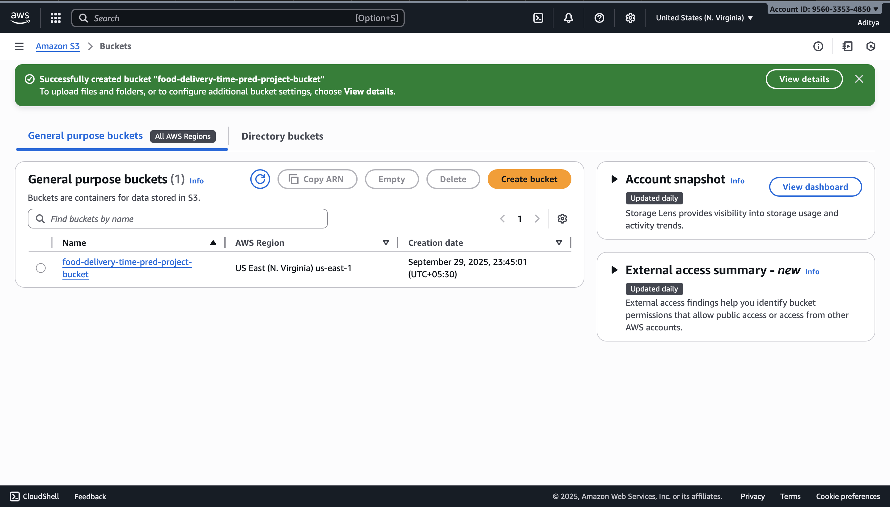
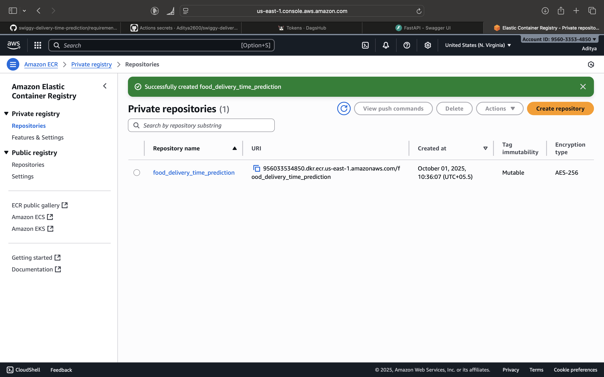
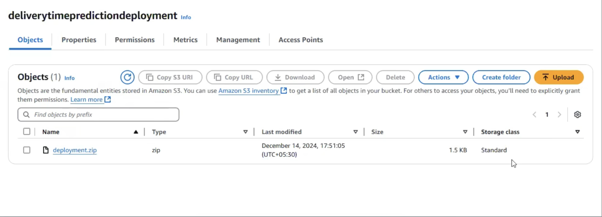
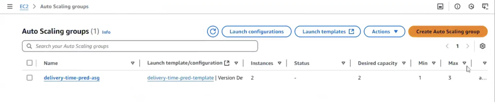

# Swiggy Delivery Time Prediction (ML + MLOps)

Predict **order ETA (minutes)** for food deliveries and ship the model with a **production‑grade MLOps stack**: DVC pipelines, MLflow tracking & model registry (DagsHub), unit tests, CI/CD (GitHub Actions), containerized FastAPI service, and AWS deployment (ECR + EC2 + CodeDeploy + Auto Scaling).

<p align="center">
  
</p>

> **Screenshots included in this repo**  
> (all under `docs/images/`)  
> `architecture.png`, `dvc_pipeline.png`, `mlflow_experiment.png`, `model_registry.png`, `s3_bucket.png`, `ecr_repo.png`, `aws_codedeploy.png`, `aws_s3_deployment.png`, `asg.png`.

---

## Table of Contents

- [Features](#features)
- [Tech Stack](#tech-stack)
- [Project Structure](#project-structure)
- [Dataset & Features](#dataset--features)
- [Quickstart (Local)](#quickstart-local)
- [Reproducible Pipeline (DVC)](#reproducible-pipeline-dvc)
- [Experiment Tracking (MLflow @ DagsHub)](#experiment-tracking-mlflow--dagshub)
- [Model Training & Evaluation](#model-training--evaluation)
- [Model Registry & Promotion](#model-registry--promotion)
- [Serving (FastAPI)](#serving-fastapi)
- [Containerization (Docker)](#containerization-docker)
- [CI/CD (GitHub Actions)](#cicd-github-actions)
- [AWS Deployment](#aws-deployment)
- [Testing](#testing)
- [Results](#results)
- [Troubleshooting](#troubleshooting)
- [License](#license)

---

## Features

- End‑to‑end **ETA regression** with robust data cleaning & feature engineering
- **Optuna** HPO for RF/LGBM & **Stacking** final estimator
- **DVC** pipeline for *data → preprocess → train → evaluate → register*
- **MLflow** tracking + **DagsHub** remote backend & **Model Registry**
- **FastAPI** service with preprocessor + model pipeline
- **Docker** image for consistent runtime
- **CI/CD** with **GitHub Actions**: tests → perf gate → promote → build/push → deploy
- **AWS**: ECR, EC2, CodeDeploy, Auto Scaling Group

---

## Tech Stack

**Python, scikit‑learn, LightGBM, Optuna, Pandas, NumPy, DVC, MLflow (DagsHub), FastAPI, Uvicorn, Docker, GitHub Actions, AWS ECR/EC2/CodeDeploy/ASG**

---

## Project Structure

```
├── data
│   ├── raw/           # swiggy.csv
│   ├── interim/       # split train/test
│   ├── processed/     # preprocessed datasets
│   └── cleaned/       # cleaned dataset
├── models/            # preprocessor & model artifacts
├── src/
│   ├── data/          # cleaning, splitting
│   ├── features/      # preprocessing
│   ├── models/        # train, evaluate, register
│   └── ...
├── scripts/           # utilities (promote model, sample_predictions.py)
├── tests/             # pytest for registry load & perf checks
├── deploy/            # appspec + scripts for CodeDeploy
├── .github/workflows/ # CI/CD pipeline
├── app.py             # FastAPI app
├── params.yaml        # pipeline & model params
└── README.md
```

---

## Dataset & Features

- Source file: **`data/raw/swiggy.csv`**
- Target: **`time_taken`** (minutes)
- Key engineered features:
  - Datetime parsing & *time of day* bucket
  - Haversine **distance** & **distance_type** (short/medium/long/very_long)
  - Weekend flag, weather, traffic normalization
  - Pickup time (order → picked)
- Preprocessing:
  - `MinMaxScaler` on numeric cols: `age, ratings, pickup_time_minutes, distance`
  - `OneHotEncoder` on nominal: `weather, type_of_order, type_of_vehicle, festival, city_type, is_weekend, order_time_of_day`
  - `OrdinalEncoder` on ordered: `traffic=[low,medium,high,jam]`, `distance_type=[short,medium,long,very_long]`

---

## Quickstart (Local)

```bash
# 1) Create env
conda create -n swiggy_eta python=3.11 -y
conda activate swiggy_eta

# 2) Install deps
pip install -r requirements-dev.txt

# 3) Set DagsHub MLflow (replace with your token)
export DAGSHUB_USER_TOKEN=xxxxxxxxxxxxxxxxxxxxxxxxxxxxxxxxxxxxxxxx
# or on Windows (PowerShell): $env:DAGSHUB_USER_TOKEN="xxxxx"
```

---

## Reproducible Pipeline (DVC)

```bash
# Pull data/artifacts tracked by DVC (requires remote access)
dvc pull

# Run pipeline stages
dvc repro
```

- Stages include: `data_cleaning → data_preparation → data_preprocessing → train → evaluation → register_model`
- DVC ensures versioned data & deterministic runs.

<p align="center">
  
</p>

---

## Experiment Tracking (MLflow @ DagsHub)

MLflow is configured to log runs to DagsHub:

```python
import dagshub, mlflow

dagshub.init(repo_owner="Aditya2600", repo_name="swiggy-delivery-time-prediction", mlflow=True)
mlflow.set_tracking_uri("https://dagshub.com/Aditya2600/swiggy-delivery-time-prediction.mlflow")
mlflow.set_experiment("DVC Pipeline")
```

<p align="center">
  
</p>

---

## Model Training & Evaluation

- Final model: **StackingRegressor** with tuned **RandomForest** + **LightGBM**, meta‑learner **LinearRegression**.
- Target transformed with **PowerTransformer** (wrapped by `TransformedTargetRegressor`).
- Evaluation metrics:
  - **MAE (train/test)**, **R²**, **5‑fold CV MAE**
- Script entry points:
  ```bash
  python src/models/train.py
  python src/models/evaluation.py
  ```

`evaluation.py` also logs the trained model (and supporting artifacts) to the current MLflow run on DagsHub and writes **`run_information.json`** with the run id & model artifact path.

---

## Model Registry & Promotion

We use DagsHub’s MLflow Model Registry.

```bash
# Register most recent run’s model
python src/models/register_model.py

# Promote latest "Staging" version → "Production"
python scripts/promote_model_to_prod.py
```

<p align="center">
  
</p>

> Some MLflow endpoints are not supported on DagsHub. This repo uses a **save‑then‑log artifacts** approach to avoid `unsupported endpoint` errors.

---

## Serving (FastAPI)

```bash
# Local dev server
python app.py
# → http://localhost:8000
```

- **`/`** health/home
- **`/predict`** accepts a single order JSON in raw schema; the app:
  1) Cleans & engineers features (`perform_data_cleaning`)  
  2) Transforms with saved **preprocessor**  
  3) Predicts with **Production** model from the registry

---

## Containerization (Docker)

```bash
# Build
docker build -t food_delivery_time_pred .

# Run (expose 8000, pass DagsHub token if the app loads model from registry)
docker run --name delivery_time_pred \
  -p 8000:8000 \
  -e DAGSHUB_USER_TOKEN=$DAGSHUB_USER_TOKEN \
  food_delivery_time_pred
```

---

## CI/CD (GitHub Actions)

Workflow: **`.github/workflows/ci-cd.yml`**

- ✅ Install deps & `dvc pull`
- ✅ Tests: registry load + performance gate (MAE threshold)
- ✅ If success: **promote** model → **Production**
- ✅ Build & push image to **ECR**
- ✅ Create **CodeDeploy** deployment (zip → upload to S3 → deploy)

---

## AWS Deployment

**Services used:**
- **S3** (stores deployment bundle used by CodeDeploy)  
  <p align="center"></p>
- **ECR** (container image registry)  
  <p align="center"></p>
- **CodeDeploy** (orchestrates app rollout on EC2)  
  <p align="center"></p>
- **S3 Deployment object** (the uploaded `deployment.zip` bundle)  
  <p align="center"></p>
- **EC2 Auto Scaling Group** (manages desired capacity)  
  <p align="center"></p>

**CodeDeploy user‑data (install agent)**

```bash
#!/bin/bash
set -e
sudo apt update -y
sudo apt install -y ruby-full wget
cd /home/ubuntu
wget https://aws-codedeploy-<region>.s3.<region>.amazonaws.com/latest/install
chmod +x ./install
sudo ./install auto
sudo systemctl enable codedeploy-agent
sudo systemctl start codedeploy-agent
```

---

## Testing

```bash
# Registry connectivity & loading
pytest tests/test_model_registry.py -q

# Performance gate on held‑out test set
pytest tests/test_model_perf.py -q
```

---

## Results

- **Test MAE ≈ 3.1 min**, **Test R² ≈ 0.83** (varies per seed)
- Top features: distance, pickup_time_minutes, traffic, order_time_of_day

---

## Troubleshooting

- **MLflow “unsupported endpoint” on DagsHub**  
  Use `mlflow.sklearn.save_model(...)` + `mlflow.log_artifacts(...)` instead of `log_model` that triggers `create_logged_model`.
- **LightGBM on macOS asks for `libomp.dylib`**  
  `brew install libomp` and reinstall lightgbm if needed.
- **Model not found at Production**  
  Ensure promotion script ran and the registry has a `Production` version.
- **API timeout from client**  
  Check security group inbound rules (allow TCP 8000 from your IP / load balancer) and instance health.

---

## License

Distributed under the MIT License. See `LICENSE` for details.